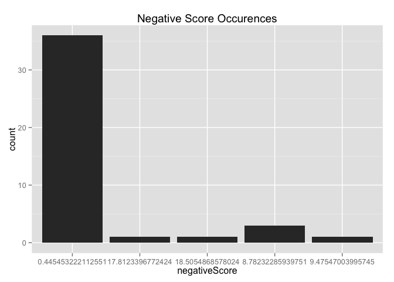
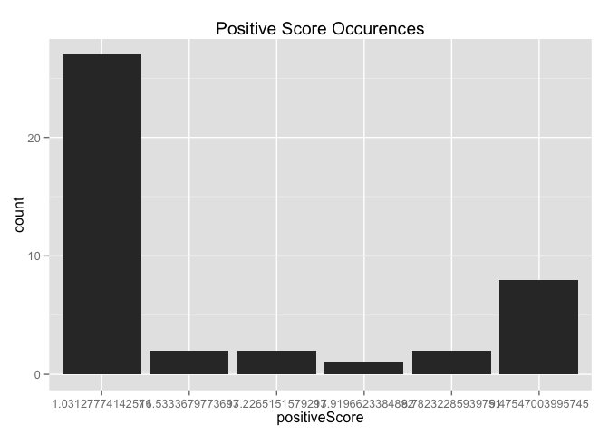

# Sentiment and Weather Analysis Write-up
Julian Haft  
## Math 241 Term Project

### The Problem
The problem I initally set out to investigate was how much Portland's famously crumby weather affects the sentiments expressed in tweets about the city.

## Disclaimer
I did not have enough data to actually try to attempt to draw any serious conclusions.

### Motivation
Twitter has become a ubiquitous means of self-expression which is entirely public. Thus more and more it has become a source of information about its users. At this point it has become so ubiquitous that nightly news often cites twitter data for vox populi type reporting. Working in media research this past summer I found that statistics about twitter were often used by producers to get a sense for audience engagement. However, many of these statistics were very basic like day-over-day percent-change in followers, numbers of retweets, number of times favorited, and so on. These are basic reliable statistics, but in both journalism and consumer research there is also a lot of interest in getting a good cross-sectional read on what twitter users think about various subjects. And doing this computationally is a major challenge which ties into a number of areas which are attracting a lot of attention in data driven industries.

One of these areas is sentiment analysis, which is an attempt to extrapolate some sort of summary of the feelings expressed in a unit of text. The initial compromise that the problem of extracting sentiment requires is the adoption of a metric for sentiment. Of course this is a challenge because even from person to person the perceived sentiment in a text is going to vary. This project is essentially an investigation of some basic methods of sentiment analysis, methods that rely on publicly shared algorithms. On the other side of the spectrum there are a number of commercial services like IBM's Alchemy API that provide the results of far more sophisticated methods. 

### Approach

First I settle on one of the options for sentiment analysis. As mentioned before there is a whole range of sophistication when it comes to sentiment analysis. I chose to go with the `qdap` package’s polarity, because the [documentation](http://trinker.github.io/qdap/vignettes/qdap_vignette.html#polarity) is excellent in terms of describing the methods used. I will also try using the `sentiment` package, which appears to be a little smarter but is not as well documented. I suspect it operates on similar principles. I am not necessarily expecting to get valid data, and the decision of which package I use may lead to my getting invalid data. However, if I do get invalid data I would rather understand the reasons why then not, so `qdap`'s sentiment analysis should allow me to make judgements about how the algorithm is working. 

### Data Acquisition
Collect data using the R package _twitteR_ `searchTwitter('Portland',since=start.date, until=end.date ,geocode=geocode)` with the geocode being provided by the _ggmap_ package's `geocode('Portland,Or')` function and `start.date` and `end.date` being dates one day apart.

I discovered rather late into the project that I could not retrieve twitter for days which were more than 7 days earlier than the time of data acquisition. In order to make the data stable I retrieved all seven days worth of data for the last week and saved them each to individual twitter files. Unfortunately, seven days was not really enough to get a read on how weather would effect sentiment in tweets about the city of Portland.

#### Explore data. 

<!--html_preserve-->

<!--/html_preserve-->

#### Initial Observations
Reading from a csv file which was the write-out of a `twListToDF` call has removed a certain amount of data. I am not exactly sure why this is but the various emoji's and the like have been removed. In order to avoid this one might try a different storage medium. For example one could try using the `twitteR` package's `search_twitter_and_store` command to store to a database, which I attempted to do but ultimately had to abandon. Part of this data loss seems due to my using `iconv(text,'ASCII', to='UTF-8-MAC', sub='byte')` on the imported data set. This was a necessary step due to issues with illegal strings produced from reading the csv.

Looking at the content of the tweets, it's clear that the sentiment analysis is going to be difficult, since many of the tweets are just declarative sentences. This is due to a flaw inherent in the project's design, which is that we lack the sophistication to select tweets where people are expressing opinions. One thought as for how that might be done is to use the statusSource field provided in the lists obtained from the `twitteR` packages `searchTwitter` function in order to eliminate generic tweets sent from applications.

Another minor problem is the lack of sentence structure. On the one hand, `qdap` relies heavily on a regular sentence structure to apply its functions, however one will almost never get that with twitter data. So it can't be helped. The `polarity` function which we will be using expects whole sentences, but right now we have whole tweets for input. However, after reviewing the theory behind how the function operates I will use tweets for input anyway. On the other hand, the `sentiment` package will not have any problems with this.

#### Basic Analysis

Now I am going to run the two basic algorithms. And compare their outputs, first we will look at a datatable produced by the `sentiment` package. Then at the output of the `polarity` function of the `qdap` package.

<!--html_preserve-->

<!--/html_preserve-->  

One of the benefits of the `sentiment` package is that it is somewhat transparent in how it decides whether something is
positive or negative in sentiment. Clearly it just compares negative to positive and assigns the sentiment as the greater of the two. However how it calculates those values is not transparent at all. And as one can see it has a tendency to assign higher positive scores than negatives scores and never assigns a 0 score to any tweets.

We will now look at the output of the `qdap` `polarity` function:

<!--html_preserve-->

<!--/html_preserve-->
The `qdap` output is a little more clear in how it is derived. In the `pos.words` or `neg.words` column you can see which word is weighted by the `polarity` algorithm. The function doesn't explicitly label things as positive or negative, so one must come up with that spectrum on one's own. I actually prefer the `qdap` results since the algorithm is more conservative and less aggressive than the `sentiment` package's. 

Based off these results, neither the `sentiment` nor the `qdap` package have provided very reliable results. But the sentiment
package has the benefit of being easier to interpret and easier to use. However, the package's sentiment analysis is disappointing and non-transparent. the `negativeScore` on the tenth tweet in the above table is a really strong indication of the package's unreliability. Therefore I would have gone with using the `qdap` package in the end, since at least it's easier to understand how that data is generated.

Now I actually have a small enough data set that I could potentially use the free alchemyAPI to do the sentiment analysis. However, I do not know how to integrate its functionality with R so it was unfeasible. As a test case I did run the first few items through the API and it decided the first four tweets in the above list were positive. Given the poor quality of the data it seems that a reassesment of the methods might be required.

Given the data I would have used the summed polarity for each given day as a variable and tried to correlate it to weather events. The `weatherData` package, which essentially scrapes [weather underground](http://www.wunderground.com) would have been used to pull a detailed weather summary for each day. And I would have assessed the correlations between weather metrics like inches of rain and the day's polarity score. To see how predictive it was I would use a regression, but I would not necessarily trust those results.

### Conclusions
Since I was not able to ultimately assess the question I set out to investigate I am going to make some general conclusions about the techniques I was trying to use. Sentiment analysis of twitter data is unlikely to be reliable unless a very smart context sensitive algorithm is used. To expand on the methods I used here, one might consider using the `openNLP` package's `Maxent_Entity_Annotator`function to identify the subjects of tweets. One could then eliminate some of the proper nouns with terms that are picked up by the `polarity` function. For instance 'rogue brewery' produced a negative score, despite the fact that the author was writing about how they were 'Falling in love with Portland already'. 

In terms of what I would do differently if I could redo the project, I think I would have been storing tweets since the time my project proposal so that I had more than 6 days of twitter data. I also might consider using the `polarity.frame` function to identify certain words in tweets that are positive or negative but may not be among the standard terms. I think ultimately sentiment analysis should be taken with a grain of salt, especially when one uses either the `qdap` or `sentiment` packages in R to do it.
